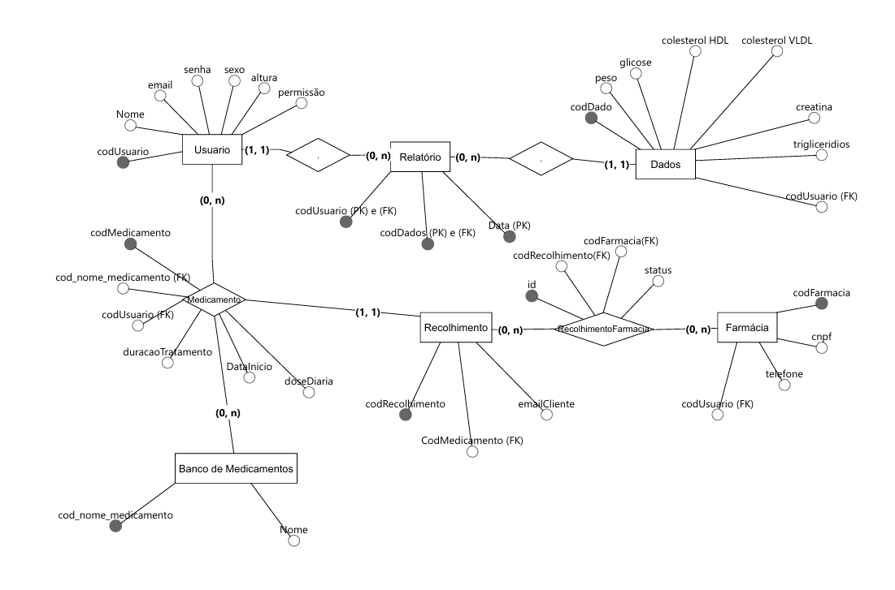
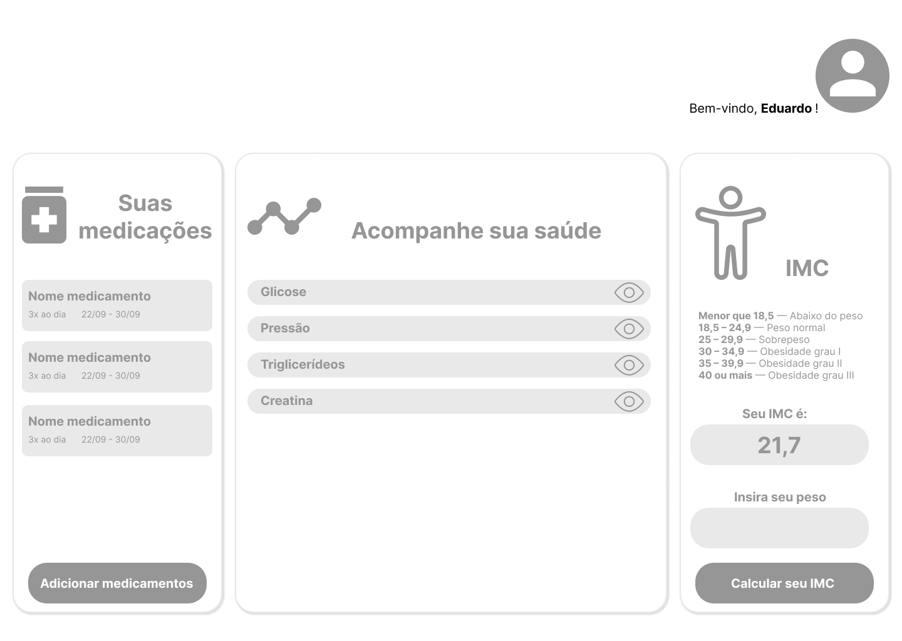

# 📌 Sistema de Acompanhamento de Saúde

Um sistema para gerenciar e monitorar dados clínicos e medicamentos, permitindo ao usuário acompanhar sua saúde de forma centralizada.  
O sistema fornece uma visão detalhada dos medicamentos em uso, suas dosagens, frequência diária, além de histórico de dados como glicose, colesterol, peso e cálculo do IMC.

---

## 🚀 Objetivo Geral 

Desenvolver um sistema que permita aos usuários controlar e acompanhar seus dados de saúde e medicamentos de maneira prática e segura.

---

## 📜 Estrutura do Banco de Dados

O sistema possui as seguintes tabelas principais:

**Usuario** – informações dos usuários do sistema.
**Dados** – registros clínicos de cada usuário, vinculados à tabela Usuario através da data de registro.
**Relatorios** – relatórios gerados a partir dos dados, associando usuário e dados pelo ID e data.
**BaseMedicamentos** – cadastro dos nomes dos medicamentos disponíveis no sistema.
**Medicamentos** – tabela que cria o relacionamento N:N entre usuários e medicamentos, armazenando informações personalizadas de cada tratamento, como dosagem, frequência e duração.

---

## 📜 Regras de Negócio

- **a)** O sistema **terá perfil de administrador**, onde será possível visualizar todos os usuários, além de manipular a base de dados de medicamentos cadasatrados.  
- **b)** Permitir a **visualização do histórico clínico**, oferecendo comparativos da evolução ao longo do tempo.  
- **c)** Acesso via **autenticação de usuário**, com validação de credenciais no banco de dados. Recuperação do usuário através do token, sem passar o ID pela URL. 
- **d)** Cada usuário poderá registrar seus medicamentos, incluindo **dosagem, aplicação e intervalo entre usos**, conforme orientação médica.  
- **e)** O relacionamento entre **Usuário e Medicamento** é **N:N**, ou seja, cada usuário pode selecionar entre os medicamentos cadastrados no banco de dados, porém as informações de uso, dosagem e afins são editadas pelo próprio usuário. Isso evita confusão com nomenclaturas e mantém a interface mais simples para todos os usuários. 
- **f)** O usuário tem controle total sobre seus dados, podendo **adicionar, editar ou excluir** registros de medicamentos e relatórios clínicos a qualquer momento.

---

## 🧰 Tecnologias Usadas

- **Backend:** Java, Spring Boot, Flyway  
- **Frontend:** Angular  
- **Documentação:** Swagger  

---

## 🛠️ Diagrama ER

---

## 🧪 Uso / Objetivos

O sistema foi desenvolvido para que usuários possam:  
1. **Cadastrar e gerenciar medicamentos**: incluindo dosagem, horários e frequência.  
2. **Registrar dados clínicos**: glicose, colesterol, peso, pressão, entre outros.  
3. **Acompanhar evolução da saúde**: visualizando gráficos e históricos dos dados registrados.  
4. **Calcular o IMC automaticamente** com base em peso e altura.  
5. **Manter total controle sobre seus dados**, garantindo privacidade e autonomia no gerenciamento.

---

## 📚 Protótipo

---

## 🌐 Documentação com Swagger

A documentação completa da API está disponível via **Swagger**, permitindo interatividade e testes dos endpoints:  
[Swagger UI](http://localhost:8080/sistema-saude/swagger-ui/index.html#)
